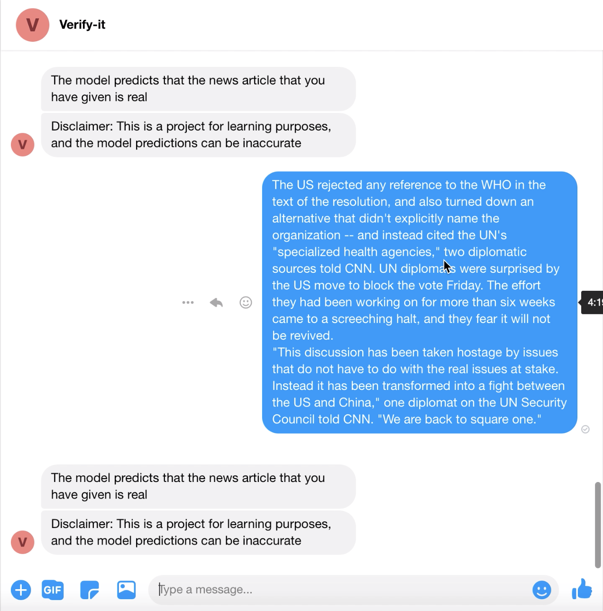

<!-- PROJECT LOGO -->
<br />
<p align="center">
  <a href="https://github.com/faykc/Verify-It">
    
  </a>

  <h2 align="center">Verify-It</h2>
  <p align="center">
    A Facebook Messenger Bot For Verifying News Articles Using Machine Learning and Natural Language Processing.
    <br />
    <br />
    <a href="https://github.com/faykc/Verify-It/issues">Report Bug</a>
    ·
    <a href="https://github.com/faykc/Verify-It/issues">Request Feature</a>
  </p>
</p>

[![Issues][issues-shield]][issues-url]
[![LinkedIn][linkedin-shield]][linkedin-url]


<!-- TABLE OF CONTENTS -->
## Table of Contents

- [Table of Contents](#table-of-contents)
- [About The Project](#about-the-project)
    - [Disclaimer](#disclaimer)
  - [Built With](#built-with)
- [Demo](#demo)
- [Getting Started](#getting-started)
  - [Prerequisites](#prerequisites)
  - [Installation](#installation)
  - [Facebook Developer App Setup](#facebook-developer-app-setup)
- [App Screenshots](#app-screenshots)
- [Contributing](#contributing)
- [Contact](#contact)
- [Acknowledgements](#acknowledgements)


<!-- ABOUT THE PROJECT -->
## About The Project

Verify-It gives you the foundations of a working facebook messenger bot, with a trained machine learning model, that can be used to classify summaries of news articles as real or fake. This project was built with the help of tutorials by [Dataflair](https://data-flair.training/blogs/advanced-python-project-detecting-fake-news/) and [Datacamp](https://www.datacamp.com/community/tutorials/scikit-learn-fake-news), along with several of my own changes and additions. Check out the [acknowledgements](#acknowledgements) for a full list of sources and readings.

#### Disclaimer
This project is meant for learning purposes and the predictions the model gives may be inaccurate.

### Built With

* [Python](https://www.python.org)
* [Flask](https://flask.palletsprojects.com/en/1.1.x/)
* [NumPy](https://numpy.org)
* [scikit-learn](https://scikit-learn.org/stable/)
* [Matplotlib](https://matplotlib.org)
* [pandas](https://pandas.pydata.org)
* [Jupyter Notebook](https://jupyter.org)
* [Pymessenger](https://github.com/davidchua/pymessenger)

## Demo


<!-- GETTING STARTED -->
## Getting Started

To get a local copy up and running follow these simple steps.

### Prerequisites
* Python 3.7.7
* Facebook Page
* Facebook Developer App

### Installation
 
1. Clone the repo
```sh
git clone https://github.com/faykc/Verify-It.git
```
2. Install the following packages
* Flask
* NumPy
* scikit-learn
* Matplotlib
* pandas
* Pymessenger
* Pickle

### Facebook Developer App Setup
The Messenger Bot must have the following permissions set in Facebook Developer settings:
1. Ability to read & write messages 

## App Screenshots



<!-- CONTRIBUTING -->
## Contributing

Contributions are what make the open source community such an amazing place to be learn, inspire, and create. Any contributions you make are **greatly appreciated**.

1. Fork the Project
2. Create your Feature Branch (`git checkout -b feature/NewFeature`)
3. Commit your Changes (`git commit -m 'Insert description of feature'`)
4. Push to the Branch (`git push origin feature/NewFeature`)
5. Open a Pull Request

<!-- ACKNOWLEDGEMENTS -->
## Acknowledgements

* Model based on tutorials by [Dataflair](https://data-flair.training/blogs/advanced-python-project-detecting-fake-news/) and [Datacamp](https://www.datacamp.com/community/tutorials/scikit-learn-fake-news)
* Thanks for the guide on creating a Messenger Bot to [William Essilfie](https://www.twilio.com/blog/2017/12/facebook-messenger-bot-python.html) on Twilio Blog
* Readings on Natural Language Processing by [Cory Malkin](https://towardsdatascience.com/natural-language-processing-feature-engineering-using-tf-idf-e8b9d00e7e76) on Medium
* Thanks othneildrew for the [README template!](https://github.com/othneildrew/Best-README-Template/blob/master/BLANK_README.md)


<!-- MARKDOWN LINKS & IMAGES -->
[issues-shield]: https://img.shields.io/github/issues/faykc/Verify-It
[issues-url]: https://github.com/faykc/Verify-It/issues
[linkedin-shield]: https://img.shields.io/badge/-LinkedIn-black.svg?style=flat-square&logo=linkedin&colorB=555
[linkedin-url]: https://ca.linkedin.com/in/faykchaudhry
[product-screenshot]: Images/Icon.png


